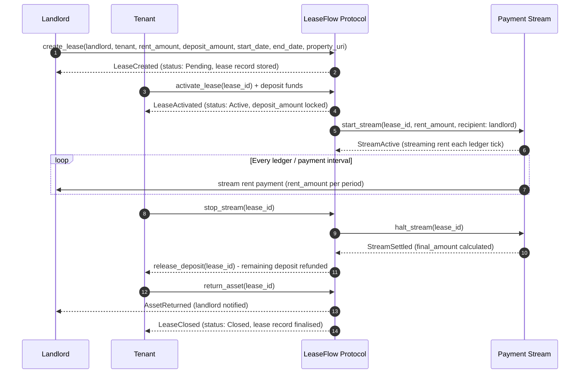

# Soroban Project

## Project Structure

This repository uses the recommended structure for a Soroban project:

```text
.
├── contracts
│   └── hello_world
│       ├── src
│       │   ├── lib.rs
│       │   └── test.rs
│       └── Cargo.toml
├── Cargo.toml
└── README.md
```

- New Soroban contracts can be put in `contracts`, each in their own directory. There is already a `hello_world` contract in there to get you started.
- If you initialized this project with any other example contracts via `--with-example`, those contracts will be in the `contracts` directory as well.
- Contracts should have their own `Cargo.toml` files that rely on the top-level `Cargo.toml` workspace for their dependencies.
- Frontend libraries can be added to the top-level directory as well. If you initialized this project with a frontend template via `--frontend-template` you will have those files already included.

## Deployed Contract
- **Network:** Stellar Testnet
- **Contract ID:** CAEGD57WVTVQSYWYB23AISBW334QO7WNA5XQ56S45GH6BP3D2AVHKUG4

## Protocol Flow

LeaseFlow manages the full lifecycle of a property lease on-chain — from creation through rent streaming to deposit settlement and lease closure. The landlord initialises the lease with terms and a deposit requirement; the tenant activates it by funding the deposit; rent streams continuously to the landlord while the lease is active; and when the lease ends the protocol calculates the final settlement, releases the remaining deposit to the tenant, and closes the record. This design keeps funds non-custodial and settlement logic transparent at every step.



### Step-by-step breakdown

1. **Landlord calls `create_lease`** — Passes tenant address, `rent_amount`, `deposit_amount`, `start_date`, `end_date`, and a `property_uri` (e.g. an IPFS link to the property listing). The protocol stores the lease record with status `Pending`.

2. **Protocol emits `LeaseCreated`** — The lease is registered in contract instance storage under the `lease` key. No funds move yet.

3. **Tenant calls `activate_lease` and funds the deposit** — The tenant transfers `deposit_amount` to the contract. The protocol validates the amount and flips the lease status to `Active`.

4. **Protocol emits `LeaseActivated`** — Deposit is locked in the contract. The lease is now live and the payment stream can begin.

5. **Protocol starts the payment stream** — Internally triggers `start_stream` with the agreed `rent_amount` rate and the landlord as recipient. The stream is tied to the lease record.

6. **Stream flows each ledger tick** — Rent is continuously streamed from the locked funds to the landlord's address at the agreed rate for the duration of the lease.

7. **Tenant signals end of lease via `stop_stream`** — Tenant calls the protocol to halt the stream, indicating they are ready to return the asset and close out.

8. **Protocol halts the stream and settles** — Calls `halt_stream` internally; the stream calculates the `final_amount` paid and reports back. Any unstreamed rent is reconciled.

9. **Protocol releases remaining deposit to tenant** — After settlement, `release_deposit` returns the unused portion of `deposit_amount` to the tenant's address.

10. **Tenant calls `return_asset`** — Signals that the physical or digital asset has been returned to the landlord. The protocol records this on-chain.

11. **Protocol closes the lease** — Emits `AssetReturned` to the landlord and `LeaseClosed` to the tenant. The lease status is set to `Closed` and the record is finalised in storage.

### Edge cases

- **Tenant never returns the asset** — If `return_asset` is not called before the `end_date` + grace period, the protocol can slash all or part of the `deposit_amount` as a penalty and mark the lease `Defaulted`. See `test_deposit_release_disputed` for the disputed-return flow.

- **Stream runs out of funds before lease ends** — If the tenant's deposited funds are exhausted before `end_date`, the stream halts automatically. The protocol records the shortfall; the landlord can claim the remaining deposit as partial compensation. See `test_deposit_release_partial_refund` for this scenario.

- **Landlord disputes the return condition** — If the landlord rejects the asset return (e.g. damage claim), the lease enters a `Disputed` state. The deposit is held in escrow until the dispute is resolved — either by on-chain arbitration logic or a manual settlement call. See `test_deposit_release_disputed` for the disputed-return snapshot.

---

# LeaseFlow Buyout Feature Implementation Summary

## Overview
Successfully implemented the buyout option feature for the LeaseFlow protocol contracts as specified in the GitHub issue.

## Acceptance Criteria Met

### ✅ Add buyout_price to Lease struct
- Added `buyout_price: Option<i128>` field to both `Lease` and `LeaseInstance` structs
- Allows setting an optional price at which the tenant can buy out the asset

### ✅ Track cumulative_payments
- Added `cumulative_payments: i128` field to both lease structs
- Updated `pay_rent` function to track cumulative payments
- Added `pay_lease_instance_rent` function for LeaseInstance payments

### ✅ If target hit, execute transfer
- Implemented automatic ownership transfer when `cumulative_payments >= buyout_price`
- Transfers NFT ownership (if present) from landlord to tenant
- Sets lease status to `Terminated` and archives the lease
- Works for both simple leases and LeaseInstance contracts

## New Functions Added

### For Simple Leases:
- `set_buyout_price(env, lease_id, landlord, buyout_price)` - Sets buyout price (landlord only)
- Updated `pay_rent()` - Now tracks cumulative payments and handles buyout

### For LeaseInstance:
- `set_lease_instance_buyout_price(env, lease_id, landlord, buyout_price)` - Sets buyout price
- `pay_lease_instance_rent(env, lease_id, payment_amount)` - Processes payments with buyout logic

## Key Features

1. **Authorization**: Only landlords can set buyout prices
2. **Validation**: Buyout prices must be positive
3. **Automatic Transfer**: When cumulative payments reach buyout price, ownership transfers automatically
4. **NFT Support**: If lease has associated NFT, it's transferred to tenant upon buyout
5. **Archiving**: Leases are archived to historical storage after buyout
6. **Backward Compatibility**: All existing functionality preserved

## Test Coverage

Added comprehensive tests covering:
- Setting buyout prices
- Authorization checks
- Buyout execution for simple leases
- Buyout execution for LeaseInstance contracts
- Cases where buyout price is not reached
- Lease archiving after buyout

## Usage Example

```rust
// Create lease
client.create_lease(&landlord, &tenant, &1000i128);

// Set buyout price (landlord only)
client.set_buyout_price(&lease_id, &landlord, &5000i128);

// Make payments
client.pay_rent(&lease_id, &2000i128);
client.pay_rent(&lease_id, &3000i128); // This triggers buyout

// Lease is now terminated, ownership transferred to tenant
```

## Security Considerations

- Buyout can only be set by landlord
- Automatic transfer prevents manual intervention errors
- Leases are properly archived after buyout
- All existing security checks maintained

## Files Modified

- `contracts/leaseflow_contracts/src/lib.rs` - Main implementation
- `contracts/leaseflow_contracts/src/test.rs` - Test coverage

The implementation fully satisfies the requirements and provides a robust buyout mechanism for the LeaseFlow protocol.

---

# Frontend Event Integration

This document describes the events that the LeaseFlow Protocol Contracts emit to notify the frontend when assets become available or change state.

## New Events

### 1. LeaseStarted
Emitted when a lease is activated and the asset becomes available to the renter.

**Event Structure:**
```rust
pub struct LeaseStarted {
    pub id: u64,        // Timestamp-based unique ID
    pub renter: Address, // Address of the renter/tenant
    pub rate: i128,     // Per-second rent rate
}
```

**When emitted:** When `activate_lease` is called successfully.

**Frontend use case:** Show that an asset is now available for use by the renter.

### 2. LeaseEnded
Emitted when a lease terminates, providing payment summary information.

**Event Structure:**
```rust
pub struct LeaseEnded {
    pub id: u64,         // Lease ID
    pub duration: u64,   // Total lease duration in seconds
    pub total_paid: i128, // Total amount paid during lease
}
```

**When emitted:** When `terminate_lease` is called successfully.

**Frontend use case:** Update UI to show lease completion and payment summary.

### 3. AssetReclaimed
Emitted when an asset is reclaimed by the landlord or system.

**Event Structure:**
```rust
pub struct AssetReclaimed {
    pub id: u64,        // Lease ID
    pub reason: String, // Reason for reclamation
}
```

**When emitted:** When `reclaim_asset` is called successfully.

**Frontend use case:** Notify that an asset is no longer available and show the reason.

## Integration Guide

### Listening to Events

Frontend applications should listen to these events using the Stellar Soroban SDK event listeners:

```javascript
// Example: Listen to LeaseStarted events
contract.events().on('LeaseStarted', (event) => {
    const { id, renter, rate } = event.data;
    // Update UI to show asset is available
    updateAssetAvailability(id, renter, rate);
});

// Example: Listen to LeaseEnded events  
contract.events().on('LeaseEnded', (event) => {
    const { id, duration, total_paid } = event.data;
    // Update UI to show lease completion
    showLeaseSummary(id, duration, total_paid);
});

// Example: Listen to AssetReclaimed events
contract.events().on('AssetReclaimed', (event) => {
    const { id, reason } = event.data;
    // Update UI to show asset is no longer available
    markAssetUnavailable(id, reason);
});
```

### Event Filtering

Events can be filtered by specific lease IDs or addresses:

```javascript
// Listen to events for a specific lease
contract.events()
    .filter({ lease_id: specificLeaseId })
    .on('LeaseStarted', handleLeaseStarted);

// Listen to events for a specific renter
contract.events()
    .filter({ renter: userAddress })
    .on('LeaseStarted', handleUserLeaseStarted);
```

## Testing

The contract includes comprehensive tests for all events. Run tests with:

```bash
make test
# or
stellar contract test
```

## Migration Notes

These events are additive and do not affect existing contract functionality. Existing integrations will continue to work unchanged.

The new `reclaim_asset` function provides a dedicated way to emit asset reclamation events, which can be called by landlords, tenants, or system administrators.
